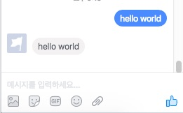
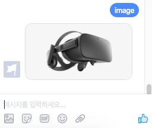
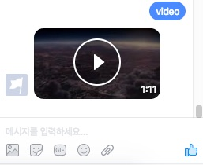
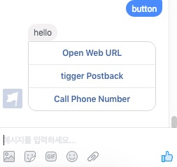
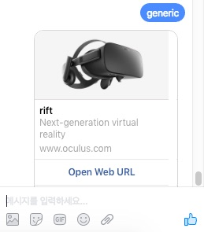

# FBMQ (Facebook Messenger Platform Library)
A Python Library For Using The Facebook Messenger Platform API (Python Facebook Chatbot Library)

# Request

## Setup

```
from fbmq import Attachment, Template, QuickReply, Page

page = Page(PAGE_ACCESS_TOKEN)
```

## Basic

#### Text
```
page.send(recipient_id, "hello world!")
```



#### Image (jpg, png, gif support)
```
page.send(recipient_id, Attachment.Image(image_url))
```



#### Audio
```
page.send(recipient_id, Attachment.Audio(audio_url))
```


#### Video
```
page.send(recipient_id, Attachment.Video(video_url))
```



#### File
```
page.send(recipient_id, Attachment.File(file_url))
```


#### quick reply
```
quick_replies = [
  QuickReply(title="Action", payload="PICK_ACTION"),
  QuickReply(title="Comedy", payload="PICK_COMEDY")
]
page.send(recipient_id, 
          "What's your favorite movie genre?",
          quick_replies=quick_replies,
          metadata="DEVELOPER_DEFINED_METADATA")
```


#### typing on/off
```
page.typing_on(recipient_id)
page.typing_off(recipient_id)
```


## Templates

#### Template : Button
```
buttons = [
  Attachment.ButtonWeb("Open Web URL", "https://www.oculus.com/en-us/rift/"),
  Attachment.ButtonPostBack("tigger Postback", "DEVELOPED_DEFINED_PAYLOAD"),
  Attachment.ButtonPhoneNumber("Call Phone Number", "+16505551234")
]
page.send(recipient_id, Template.Buttons("hello", buttons))
```



#### Template : Generic
```
page.send(recipient_id, Template.Generic([
  Template.GenericElement("rift",
                          subtitle="Next-generation virtual reality",
                          item_url="https://www.oculus.com/en-us/rift/",
                          image_url=CONFIG['SERVER_URL'] + "/assets/rift.png",
                          buttons=[
                              Template.ButtonWeb("Open Web URL", "https://www.oculus.com/en-us/rift/"),
                              Template.ButtonPostBack("tigger Postback", "DEVELOPED_DEFINED_PAYLOAD"),
                              Template.ButtonPhoneNumber("Call Phone Number", "+16505551234")
                          ]),
  Template.GenericElement("touch",
                          subtitle="Your Hands, Now in VR",
                          item_url="https://www.oculus.com/en-us/touch/",
                          image_url=CONFIG['SERVER_URL'] + "/assets/touch.png",
                          buttons=[
                              Template.ButtonWeb("Open Web URL", "https://www.oculus.com/en-us/rift/"),
                              Template.ButtonPostBack("tigger Postback", "DEVELOPED_DEFINED_PAYLOAD"),
                              Template.ButtonPhoneNumber("Call Phone Number", "+16505551234")
                          ])
]))
```



#### Template : Receipt
```
    element = Template.ReceiptElement(title="Oculus Rift",
                                      subtitle="Includes: headset, sensor, remote",
                                      quantity=1,
                                      price=599.00,
                                      currency="USD",
                                      image_url=CONFIG['SERVER_URL'] + "/assets/riftsq.png"
                                      )

    address = Template.ReceiptAddress(street_1="1 Hacker Way",
                                      street_2="",
                                      city="Menlo Park",
                                      postal_code="94025",
                                      state="CA",
                                      country="US")

    summary = Template.ReceiptSummary(subtotal=698.99,
                                      shipping_cost=20.00,
                                      total_tax=57.67,
                                      total_cost=626.66)

    adjustment = Template.ReceiptAdjustment(name="New Customer Discount", amount=-50)

    fbpage.send(recipient_id, Template.Receipt(recipient_name='Peter Chang',
                                            order_number='1234',
                                            currency='USD',
                                            payment_method='Visa 1234',
                                            timestamp="1428444852",
                                            elements=[element],
                                            address=address,
                                            summary=summary,
                                            adjustments=[adjustment]))
```


# Handle Webhook

## Usage (with flask)
```
from flask import Flask, request
import fbmq

@app.route('/webhook', methods=['POST'])
def webhook():
  payload = request.get_date(as_text=True)
  fbmq.handle_webhook(payload,
                      optin=optin_handler,
                      message=message_handler,
                      delivery=delivery_handler,
                      postback=postback_handler,
                      read=read_handler,
                      account_linking=account_linking_handler)
  return "ok"

def message_handler(event):
  sender_id = event['sender']['id']
  message = event['message']
  
  page = fbmq.Page(PAGE_ACCESS_TOKEN)  
  page.send(sender_id, "thank you! your message is '%s'" % message)
```
