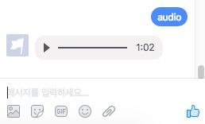
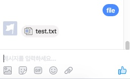
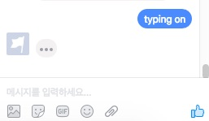
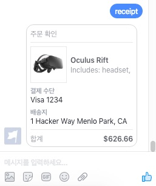

# FBMQ (Facebook Messenger Platform Python Library)
[](https://pypi.python.org/pypi/fbmq)
[](https://travis-ci.org/conbus/fbmq)
[](https://coveralls.io/github/conbus/fbmq?branch=master)
[](https://pypi.python.org/pypi/fbmq)

A Python Library For Using The Facebook Messenger Platform API (Python Facebook Chat & Chatbot Library)
Facebook messenger platform api full features are supported
## Table of Contents

* [Install](#install)
* [Handle webhook](#handle-webhook)
  * [usage (with flask)](#usage-with-flask)
  * [handlers](#handlers)
* [Send a message](#send-a-message)
  * [basic](#basic)
    * [text](#text)
    * [image](#image) / [audio](#audio) / [video](#video) / [file](#file)
    * [quick reply](#quick-reply)
      * [quick reply callback](#quick-reply-callback)
    * [typing on/off](#typing-onoff)
  * [templates](#templates)
    * [button](#template--button)
      * [button callback](#button-callback)
    * [generic](#template--generic)
    * [receipt](#template--receipt)
* [Example](#example)


# Install
```
pip install fbmq
```

# Handle webhook
how to handle messages from user to facebook page

### Usage (with flask)
```python
from flask import Flask, request
from fbmq import Page

page = fbmq.Page(PAGE_ACCESS_TOKEN)

@app.route('/webhook', methods=['POST'])
def webhook():
  page.handle_webhook(request.get_data(as_text=True))
  return "ok"

@page.handle_message
def message_handler(event):
  sender_id = event['sender']['id']
  message = event['message']
  
  page.send(sender_id, "thank you! your message is '%s'" % message)
```

### handlers
`@page.handle_message` - This callback will occur when a message has been sent to your page.

`@page.handle_echo` - This callback will occur when a message has been sent by your page

`@page.handle_delivery` - This callback will occur when a message a page has sent has been delivered.

`@page.handle_optin` - This callback will occur when the [Send-to-Messenger](https://developers.facebook.com/docs/messenger-platform/plugin-reference/send-to-messenger) plugin has been tapped

`@page.handle_postback` - Postbacks occur when a Postback button, Get Started button, Persistent menu or Structured Message is tapped.

`@page.handle_read` - This callback will occur when a message a page has sent has been read by the user.

`@page.handle_account_linking` - This callback will occur when the Linked Account or Unlink Account call-to-action have been tapped.

#### if you don't need a decorator
```python
@app.route('/webhook', methods=['POST'])
def webhook():
  page.handle_webhook(request.get_data(as_text=True),
                      message=message_handler)
  return "ok"

def message_handler(event):
  sender_id = event['sender']['id']
  message = event['message']
  
  page.send(sender_id, "thank you! your message is '%s'" % message)
```

# Send a message
how to send a message from facebook page to user

### Basic

##### Import
```python
from fbmq import Attachment, Template, QuickReply, Page
```

##### Text
```python
page.send(recipient_id, "hello world!")
```


##### Image
jpg, png, gif support
```python
page.send(recipient_id, Attachment.Image(image_url))
```


##### Audio
```python
page.send(recipient_id, Attachment.Audio(audio_url))
```

##### Video
```python
page.send(recipient_id, Attachment.Video(video_url))
```


##### File
```python
page.send(recipient_id, Attachment.File(file_url))
```


##### quick reply
```python
quick_replies = [
  QuickReply(title="Action", payload="PICK_ACTION"),
  QuickReply(title="Comedy", payload="PICK_COMEDY")
]

# you can use a dict instead of a QuickReply class
#
# quick_replies = [{'title': 'Action', 'payload': 'PICK_ACTION'},
#                {'title': 'Comedy', 'payload': 'PICK_COMEDY'}}


page.send(recipient_id, 
          "What's your favorite movie genre?",
          quick_replies=quick_replies,
          metadata="DEVELOPER_DEFINED_METADATA")
```

##### quick reply callback
you can define easily a quick reply callback method.
```python
@page.callback_quick_reply(['PICK_ACTION', 'PICK_COMEDY'])
def callback_picked_genre(payload, event):
  print(payload, event)
  
# Also supported regex, it works corretly
# @page.callback_quick_reply(['PICK_(.+)'])
```


##### typing on/off
```python
page.typing_on(recipient_id)
page.typing_off(recipient_id)
```


### Templates

##### Template : Button
```python
buttons = [
  Attachment.ButtonWeb("Open Web URL", "https://www.oculus.com/en-us/rift/"),
  Attachment.ButtonPostBack("trigger Postback", "DEVELOPED_DEFINED_PAYLOAD"),
  Attachment.ButtonPhoneNumber("Call Phone Number", "+16505551234")
]

# you can use a dict instead of a Button class
#
# buttons = [{'type': 'web_url', 'title': 'Open Web URL', 'value': 'https://www.oculus.com/en-us/rift/'},
#          {'type': 'postback', 'title': 'trigger Postback', 'value': 'DEVELOPED_DEFINED_PAYLOAD'},
#          {'type': 'phone_number', 'title': 'Call Phone Number', 'value': '+16505551234'}]

page.send(recipient_id, Template.Buttons("hello", buttons))
```

##### button callback
you can define easily a button postback method (it works only postback type buttons).
```python
@page.callback_button(['DEVELOPED_DEFINED_PAYLOAD'])
def callback_clicked_button(payload, event):
  print(payload, event)
  
# Also supported regex, it works corretly
# @page.callback_button(['DEVELOPED_DEFINE(.+)'])
```


##### Template : Generic
```python
page.send(recipient_id, Template.Generic([
  Template.GenericElement("rift",
                          subtitle="Next-generation virtual reality",
                          item_url="https://www.oculus.com/en-us/rift/",
                          image_url=CONFIG['SERVER_URL'] + "/assets/rift.png",
                          buttons=[
                              Template.ButtonWeb("Open Web URL", "https://www.oculus.com/en-us/rift/"),
                              Template.ButtonPostBack("tigger Postback", "DEVELOPED_DEFINED_PAYLOAD"),
                              Template.ButtonPhoneNumber("Call Phone Number", "+16505551234")
                          ]),
  Template.GenericElement("touch",
                          subtitle="Your Hands, Now in VR",
                          item_url="https://www.oculus.com/en-us/touch/",
                          image_url=CONFIG['SERVER_URL'] + "/assets/touch.png",
                          buttons=[
                              Template.ButtonWeb("Open Web URL", "https://www.oculus.com/en-us/rift/"),
                              Template.ButtonPostBack("tigger Postback", "DEVELOPED_DEFINED_PAYLOAD"),
                              Template.ButtonPhoneNumber("Call Phone Number", "+16505551234")
                          ])
]))
```


##### Template : Receipt
```python
    element = Template.ReceiptElement(title="Oculus Rift",
                                      subtitle="Includes: headset, sensor, remote",
                                      quantity=1,
                                      price=599.00,
                                      currency="USD",
                                      image_url=CONFIG['SERVER_URL'] + "/assets/riftsq.png"
                                      )

    address = Template.ReceiptAddress(street_1="1 Hacker Way",
                                      street_2="",
                                      city="Menlo Park",
                                      postal_code="94025",
                                      state="CA",
                                      country="US")

    summary = Template.ReceiptSummary(subtotal=698.99,
                                      shipping_cost=20.00,
                                      total_tax=57.67,
                                      total_cost=626.66)

    adjustment = Template.ReceiptAdjustment(name="New Customer Discount", amount=-50)

    fbpage.send(recipient_id, Template.Receipt(recipient_name='Peter Chang',
                                            order_number='1234',
                                            currency='USD',
                                            payment_method='Visa 1234',
                                            timestamp="1428444852",
                                            elements=[element],
                                            address=address,
                                            summary=summary,
                                            adjustments=[adjustment]))
```


# Example

1. fill example/config.py
2. run server
```bash
cd example
virtualenv env
source env/bin/activate
pip install -r requirements.txt
python server.py
```










